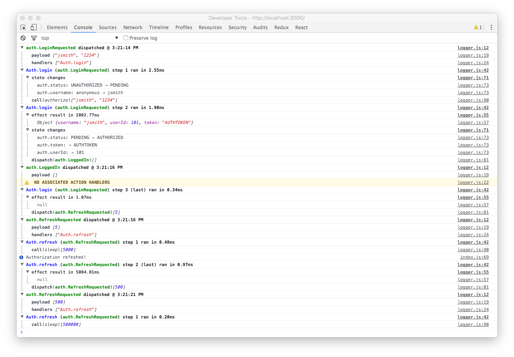

<p align='center'>
  <br/>
  <b>EXPERIMENTAL &mdash; WORK-IN-PROGRESS</b>
</p>

A pragmatic library for simply connecting [MobX](http://mobxjs.github.io/mobx/) data stores and asynchronous actions to functional stateless React components with a flux-like architecture inspired by `redux`, `react-redux` and `redux-saga`.



## Benefits

The intent of the library is to provide straightforward flux-style state management with a pragmatic trade-off between formality and convenience. Keep in mind as you evaluate this approach that your application may be better suited to different trade-offs (i.e. a more formal but less "convenient" alternative).

##### Simple Organization
Conveniently organize state, initializers and action handlers that modify that state together as "models" while retaining the flexibility to keep them separate when that works better.

##### Functional Views
Simply connect your state and actions to pure React components (i.e. props-only) using React context and a straightforward connect wrapper for one-way data flow.

##### Easy Async
Write declarative asynchronous logic naturally using generator functions for managing side effects without forfeiting control.

##### Built-in Efficiency
Built on MobX to efficiently manage the impact of data changes on recalculations and re-renders. MobX makes it easy to write memoizing derived views of your data and structure your application for fine-grained reactive updates without jumping through hoops.

##### Decoupled Testing
Test your functional views independent of your state, test your state independent of your views, and test your actions handlers independent of async dependencies like backend servers elementally without writing extensive mocks.

## Building Blocks

The mobx-reactor building blocks are a `Store`, composed of `Substore` objects, together with `Action` methods connected to React components through a `StoreContext` and a `connect` wrapper.

### Store

A single shared `Store` holds application state and provides a method to `dispatch` actions to affect application logic. The `store` is assembled from `Substore` sub-objects that each define and manage a piece of the application state. A `Store` can be configured with `middleware` that provides an extension point for performing activities like logging and crash reporting.


```javascript
const store = new Store(
  {
    todoList: new TodoList(),
  },
  [
    logger()
  ]
)
```

> The logger currently requires you to first `npm install deep-diff`.


### Substores

A `Substore` provides a construct to organize state in sub-stores with methods that operate on that state in response to relevant actions. A sub-store objects are a vehicle for organization, not encapsulation. While all state is defined through this stores, actions can be defined as part of a store or independently of a store.

```javascript
class TodoList extends Substore {
  @observable todos = map({});

  @computed get unfinishedTodoCount() {
    return this.todos.values().filter(todo => !todo.isFinished).length;
  }

  @action('addTodo')
  addTodo(title) {
    const todo = new Todo(title)
    this.todos.set(todo.id, todo)
    return dispatch('saveTodo')(todo.id)
  }

  @action('saveTodo')
  saveTodo(todoId) {
    return function* () {
      const todo = this.todos.get(todoId)
      try {
        yield call(server.saveTodo)({id: todo.id, title: todo.title})
        return dispatch('todoSaved')({id: todo.id, title: todo.title})
      } catch (error) {
        return dispatch('alertUser')(
          'Your todo could not be saved.',
          {
            detailedMessage: error.toString(),
            onRetry: dispatch('saveTodo')(todoId)
          }
        )
      }
    }.bind(this)()
  }

  @action('toggleTodo')
  toggleTodo(todoId) {
    const todo = this.todos.get(todoId)
    todo.isFinished = !todo.isFinished
  }
}
```

The `@action(type)` decorator declares that the decorated method responds to the named action type. There is no relationship between the method name and the action type.

### Actions

Action handlers may be execute immediately when declared as a regular function or asynchronously when the action handler is defined as a generator function.

> Currently, decorators and generator methods are not cooperating syntactically, but this should be resolved as [the decorator specification is refined and babel incorporates those improvements](https://github.com/babel/babylon/pull/14). The examples show how you can return a bound generator function until the syntactic convenience is available.

#### Generator Actions

Asynchronous tasks are supported in generator actions through an inversion of control that allows the store to step through the yield statements of the generator.


### Store Context

A `StoreContext` component is created to share the store with child components.

```javascript
<StoreContext store={store}>
  <TodoListViewContainer/>
</StoreContext>
```

### Connections

This experiment has as one of its primary goals to enable writing stateless functional ("pure") React components like this one:

```javascript
class TodoListView extends React.Component {
  handleSubmit = (event) => {
    event.preventDefault()
    this.props.addTodo(this.refs.newTodoTitle.value)
    this.refs.newTodoTitle.value = ''
  }
  render() {
    return (
      <div>
        <ul>
          {this.props.todos.values().map(todo =>
            <TodoView
              key={todo.id}
              title={todo.title}
              isFinished={todo.isFinished}
              onToggle={() => this.props.toggleTodo(todo.id)}
            />
          )}
        </ul>
        Tasks left: {this.props.unfinishedTodoCount}
        <form onSubmit={this.handleSubmit}>
          <label><input ref="newTodoTitle" placeholder="Add todo..." /> <button type="submit">Add</button></label>
        </form>
      </div>
    )
  }
}
```

Components written like this can be tested independent of the state management framework and used with other state manage frameworks like Redux.

With `StoreContext` as a parent, child components can be simply and declaratively wrapped with a Connect component that manages the state updates from the Store.

```javascript
const TodoListViewContainer = connect(
  {
    todos: store => store.state.todoList.todos,
    unfinishedTodoCount: store => store.state.todoList.unfinishedTodoCount,
    toggleTodo: store => store.dispatch('toggleTodo'),
    addTodo: store => store.dispatch('addTodo')
  }
)(TodoListView)
```

### Example

Want to try a working example? Here's how!

```
npm install
cd examples/basic
npm install
npm start
```

Note that the `package.json` files in the examples directory do not contain a full list of actual dependencies, but "inherit" dependencies from main mobx-reactor project. This ensures that all modules import the same MobX modules, otherwise there will be an identity crises.
